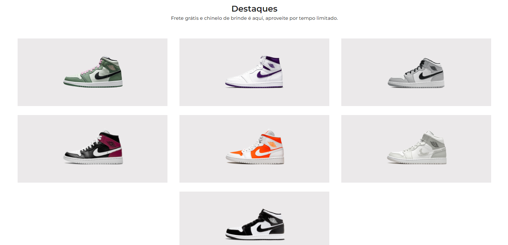

# Desafio 2 - Codelândia
Nesse desafio, foi proposto criar uma loja de tênis Jordan. [Link do desafio no Figma](https://www.figma.com/file/Yb9IBH56g7T1hdIyZ3BMNO/Codel%C3%A2ndia-Desafios?node-id=1883%3A2)

## Tecnologias usadas no projeto

### Veja como ficou cliquando na imagem
